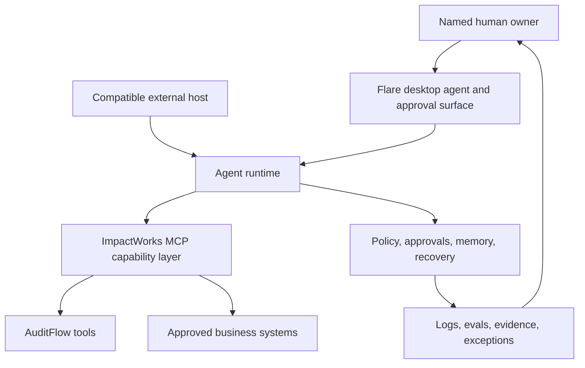

# ImpactWorks AI Workforce MCP

Governed AI-agent capabilities for diagnosing, designing, deploying, and operating an AI workforce.

This repository contains the public technical foundation for:

- **ImpactWorks AuditFlow** — a deterministic workflow audit, opportunity-scoring, ROI, and roadmap engine.
- **ImpactWorks MCP capability layer** — bounded, tenant-aware tools shared by compatible agent hosts.
- **Flare** — the working name for an installable desktop agent and human approval surface.
- **AgentOps** — quality, observability, governance, and continuous improvement.

> Status: early development. AuditFlow is the first vertical slice. Flare is a working name and not yet a production commitment.

## Product sequence

```text
AuditFlow
  -> AI Workforce Blueprint
  -> Connected foundation
  -> First bounded workflow or agent
  -> Flare installable experience
  -> AgentOps
```

The immediate build priority is the host-neutral capability core. Flare will consume the same governed contracts rather than becoming a disconnected chatbot.

## Architecture



See [Architecture](docs/architecture.md) for the trust boundaries, data model, and execution model.

## AuditFlow tool surface

The first bounded MCP product defines seven tools:

| Tool | Purpose | State change |
| --- | --- | --- |
| `create_audit` | Create a tenant-scoped audit and baseline | Yes |
| `upsert_workflow` | Record or revise a workflow | Yes |
| `score_opportunities` | Calculate impact, feasibility, risk, confidence, and priority | No |
| `estimate_roi` | Calculate low, expected, and high scenarios | No |
| `recommend_solution_stack` | Recommend vendor-neutral patterns and controls | No |
| `generate_roadmap` | Persist a sequenced implementation roadmap | Yes |
| `get_audit_report` | Assemble a decision-ready report | No |

Official scores and ROI come from deterministic, versioned application code—not model-generated arithmetic.

## Current implementation

- Versioned opportunity-scoring engine
- Versioned ROI scenario engine
- Boundary and golden tests
- Public development roadmap
- Flare onboarding specification informed by current installable-agent patterns

## Development

Requirements:

- Node.js 22 or newer
- npm 10 or newer

Run the tests:

```bash
npm test
```

Repository layout:

```text
packages/
  scoring-engine/       Deterministic scores and ROI
tests/                  Node test suite
docs/
  architecture.md       System and trust architecture
  development-roadmap.md
  flare-onboarding.md
```

## Operating principles

- Start with a measurable business constraint.
- Build one bounded, reliable workflow before expanding the catalog.
- Derive tenant and user identity from trusted authentication—not model arguments.
- Apply least privilege and progressive permission grants.
- Require explicit approval for consequential external actions.
- Preserve evidence, formula versions, exceptions, and recovery paths.
- Keep the product useful without a proprietary UI component.
- Treat installation ease and security as one design problem.

## Documentation

- [Architecture](docs/architecture.md)
- [Development roadmap](docs/development-roadmap.md)
- [Flare install and onboarding](docs/flare-onboarding.md)
- [Contributing](CONTRIBUTING.md)
- [Security](SECURITY.md)

## Project status

This is an early public development repository. Interfaces and architecture may change before the first tagged release.

Copyright © 2026 ImpactWorks. No license is granted unless a license file is added to this repository.
