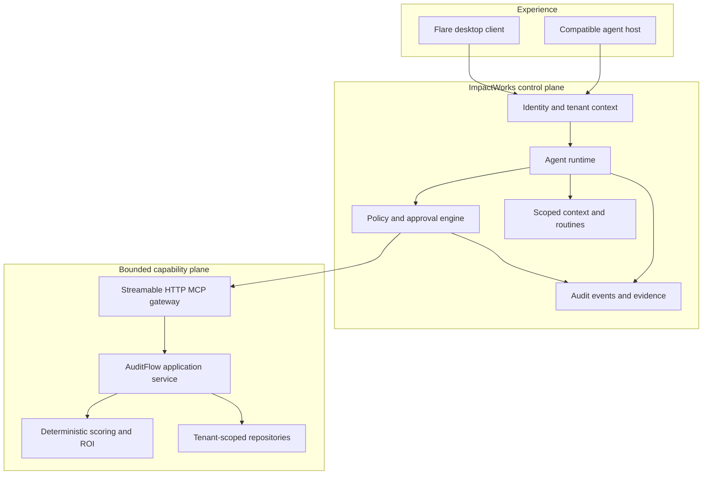

# System Architecture

## Product boundary

ImpactWorks AI Workforce is a governed system of agents, tools, integrations, approvals, measurement, and human ownership. MCP servers expose bounded capabilities; they are not the agent personality, user interface, or policy authority.

AuditFlow is the first product server. Flare is the working name for the installable desktop agent and approval surface that will consume the same contracts.

## Logical architecture



## Trust boundaries

1. **User and device:** local UI state and user intent are not authorization by themselves.
2. **Identity boundary:** access tokens establish tenant, user, role, and audience.
3. **Policy boundary:** the runtime checks allowed, approval-required, and prohibited actions.
4. **Capability boundary:** every MCP server exposes a narrow tool contract.
5. **Repository boundary:** every query repeats tenant scoping.
6. **External-system boundary:** connections use least-privilege scopes and revocable credentials.
7. **Evidence boundary:** logs capture decisions and outcomes without storing secrets or unnecessary payloads.

## AuditFlow data model

| Entity | Purpose |
| --- | --- |
| Tenant | Customer boundary and lifecycle |
| User | Authenticated actor and role |
| Audit | Business context, goals, constraints, and status |
| Workflow | Versioned process description and evidence quality |
| Opportunity score | Versioned component and priority scores |
| ROI estimate | Versioned assumptions and scenarios |
| Roadmap | Sequenced initiatives and decision gates |
| Audit event | Actor, event type, time, and safe evidence |

## Deterministic calculations

The model gathers context, selects tools, and explains results. Versioned application code calculates official values.

```text
impact =
  0.30 * labor_value_score +
  0.20 * volume_score +
  0.20 * error_cost_score +
  0.15 * customer_impact_score +
  0.15 * revenue_impact_score

feasibility =
  0.25 * rule_clarity_score +
  0.20 * digital_input_score +
  0.20 * integration_readiness_score +
  0.15 * data_quality_score +
  0.10 * process_stability_score +
  0.10 * owner_readiness_score

priority = clamp(
  0.50 * impact +
  0.30 * feasibility +
  0.20 * confidence -
  0.20 * risk,
  0,
  100
)
```

Revenue uplift defaults to zero unless the user supplies a defensible value and explicitly enables it.

## Execution targets

- TypeScript on Node.js 22+
- Stateless MCP Streamable HTTP transport
- PostgreSQL persistence
- Runtime schema validation
- OAuth 2.1 authorization code with PKCE
- Structured, redacted logs and OpenTelemetry traces
- Signed and notarized macOS distribution for the first Flare proof

Hosting, identity provider, and first external host remain implementation decisions rather than hard-coded assumptions.
