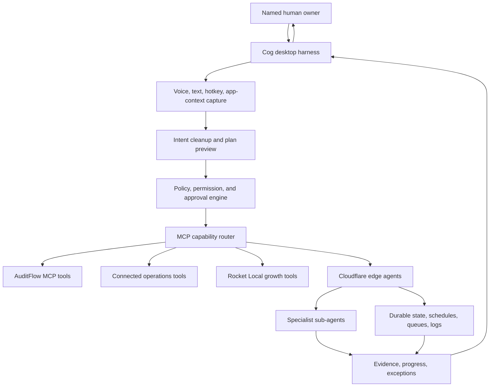

# Cog Workforce Harness Roadmap

Status: approved direction for the Cog proof. Cog remains a working name.

## Product intent

Cog should become the ImpactWorks Workforce MCP Harness: the user-facing desktop control layer for requesting work, approving actions, monitoring progress, and coordinating governed edge agents.

The product inspiration is the emerging desktop-agent pattern where a user can state a rough goal, assign work, and receive finished files or actions without configuring workflows first. The ImpactWorks version should preserve that ease while adding business-grade controls: named owners, tenant boundaries, approval gates, logs, evidence, revocation, and measurable outcomes.

## ImpactWorks spin

Lemon-style desktop agents make the computer feel like the execution surface. Cog should make the AI workforce feel like the execution surface.

```text
Messy user intent
  -> Cog Workforce Harness
  -> Policy and approval preview
  -> MCP capability router
  -> Edge agents and bounded tools
  -> Evidence-backed output
  -> Human review, approval, or escalation
```

Cog is not only a mascot, chat window, or voice-to-text helper. It is the visible operator console for a governed workforce.

## Cloudflare edge-agent role

Cloudflare Agents are a strong fit for the server-side runtime behind this harness because they provide durable agent identity, local state, real-time connections, scheduling, recoverable work, and sub-agent patterns on top of Durable Objects.

Use Cloudflare-style edge agents for work that benefits from durable cloud state:

- Long-running jobs that may wait on APIs, approvals, scheduled checks, or human input.
- Per-user, per-client, per-audit, or per-workflow agent instances with isolated state.
- Parallel specialist agents coordinated by a parent harness agent.
- Webhook, Slack, email, browser, voice, or chat entry points.
- MCP tool orchestration and recoverable execution logs.

Do not use edge agents to bypass the core ImpactWorks trust model. The harness must still enforce tenant isolation, least privilege, approval requirements, observable state, and off switches.

## Reference architecture



## First harness capabilities

### 1. Intent capture

- Global hotkey or visible prompt window.
- Voice or text input.
- Optional active-app context when the user grants access.
- Messy-thought cleanup into a proposed task.

### 2. Plan and permission preview

- Proposed goal.
- Systems and data involved.
- Read actions.
- Draft/write actions.
- Actions requiring approval.
- Known risks and rollback path where supported.

### 3. Governed execution

- Route work through approved MCP tools first.
- Use edge agents for durable coordination, waiting, retries, schedules, and specialist parallel work.
- Keep official scores, financial estimates, and operational records in deterministic server code, not model-generated text.

### 4. Approval cards

- Show destination, affected data, consequence, and owner.
- Support approve, reject, edit, retry, or stop.
- Require explicit approval for messages, proposals, commitments, purchases, permission changes, and client-system mutations.

### 5. Evidence and recovery

- Progress timeline.
- Tool calls and formula versions.
- Source references and missing evidence.
- Exceptions and escalation owner.
- Stop/off switch.

### 6. Routine capture

- Observe a demonstrated workflow only after consent.
- Save a draft routine with steps, tools, permissions, and approvals.
- Activate routines only after owner review.

## Edge-agent patterns

### AuditFlow Agent

Coordinates audit intake, workflow capture, scoring, ROI, roadmap, and report generation. In the first proof, this should stop at an approval-ready report and next-step recommendation.

### Proposal and Follow-Up Agent

Supports the internal lead-to-proposal golden path. It can gather context, draft follow-up, prepare proposal inputs, update internal records, and schedule review, but sending or committing remains approval-gated.

### Research and Briefing Agent

Collects market, prospect, company, or workflow context for a bounded business task. It must cite sources and mark confidence.

### Ops Monitor Agent

Watches approved workflows, schedules, receipts, exceptions, and overdue approvals. It alerts the owner instead of silently changing external systems.

### Routine Builder Agent

Turns a demonstrated or repeated process into a draft routine with required tools, permissions, evidence, and quality checks.

## Build sequence

### Phase A - Harness contract

- Define task, plan, approval, evidence, and agent-run contracts.
- Define allowed agent states: idle, listening, planning, waiting for permission, working, waiting for approval, completed, failed, blocked, stopped.
- Define the event log shape used by Cog, MCP tools, and edge agents.

### Phase B - Local harness prototype

- Build a Mac-first Cog shell with text input first and voice later.
- Display plan previews and approval cards.
- Connect to mocked or local AuditFlow outputs before production edge orchestration.

### Phase C - First edge-agent proof

- Run one Cloudflare-backed AuditFlow Agent or Proposal and Follow-Up Agent.
- Persist state, progress, evidence, and approvals.
- Demonstrate pause/resume and recovery from a failed tool call.

### Phase D - Multi-agent harness

- Add parent/child agent coordination for specialist work.
- Add routine capture and versioned routine review.
- Expand communication channels only after the first harness path is reliable.

## Non-goals for the first proof

- No universal autonomous computer operator.
- No broad access to all user apps by default.
- No unsupervised client-system writes.
- No credential sharing through chat.
- No public claims of autonomous work without measured proof.
- No production dependence on Cog before AuditFlow and the first bounded workflow are reliable.

## Acceptance gates

- A user can understand what the harness intends to do before approving it.
- Every consequential action has a visible owner, destination, affected data, and consequence.
- Edge agents preserve tenant separation and least-privilege tool access.
- Durable jobs can report status, recover or escalate, and stop cleanly.
- Logs support review without leaking secrets or unnecessary customer content.
- Unauthorized actions, approval bypasses, and tenant violations remain zero.
