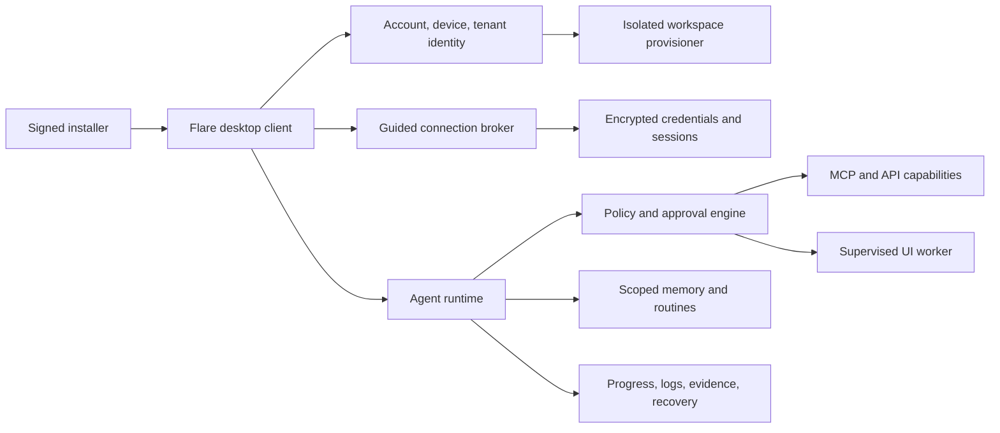

# Flare Install and Onboarding Experience

Status: product requirement for the Flare proof. Flare remains a working name.

## Research basis

This specification draws on the publicly demonstrated onboarding model for Grok Bot:

- [Introducing Grok Bot](https://x.ai/news/introducing-grok-bot), xAI, August 11, 2026
- [Grok Bot Is The First AI Agent You Just Install](https://www.youtube.com/watch?v=LM7Ft7g8qJw), Nate B. Jones, August 14, 2026

xAI states that Bots receive a cloud computer, sign into existing applications, operate across UI and tools even without an API or MCP integration, persist while the user is away, share context, learn routines by observing work, and return for approvals. The video review highlights the onboarding advantage of installing one app, authorizing services conversationally, and reusing authenticated sessions across Bots. It also identifies the shared computer as the primary security perimeter.

The exact private implementation is not public. The component model below is an engineering inference from the observed product behavior.

## Experience goal

A nontechnical user should reach a safe, useful outcome without installing a CLI, configuring an MCP server, writing a workflow, or understanding agent architecture.

Target first-use path:

```text
Download
  -> Install
  -> Sign in
  -> State one goal
  -> Connect only the systems required for that goal
  -> Preview plan and permissions
  -> Approve a bounded first task
  -> Watch progress and evidence
  -> Review outcome
```

## What Flare should adopt

### One guided install

- Signed and notarized macOS package.
- No terminal or developer-tool requirement.
- Automatic updates with release notes and rollback support.
- Account, device, and tenant registration inside the app.

### Conversation before configuration

The first screen asks one outcome question, not for integrations or technical settings. Flare translates that outcome into the smallest required capability set.

### Connect in context

- Request a connection only when the chosen task needs it.
- Prefer OAuth or MCP authorization with narrow scopes.
- When no API or MCP path exists, offer a supervised remote-browser sign-in.
- Never ask the user to paste a password into chat.
- Show what will be read, what may be written, which agent can use it, and how to revoke it.

### First useful task

The first task must be bounded, reversible where possible, and approval-safe. For the initial ImpactWorks proof, Flare should analyze or prepare the lead-to-proposal workflow and stop at an approval-ready artifact before sending anything.

### Routine learning

- The user may demonstrate a workflow while Flare observes steps and decisions.
- Flare saves a draft routine, not an immediately active automation.
- The user reviews steps, permissions, exceptions, and approval points.
- A routine activates only after explicit approval and receives a version.

### Progressive trust

Start in observe-and-draft mode. Expand autonomy only after successful runs and explicit owner approval.

```text
Observe -> Recommend -> Draft -> Act with approval -> Bounded autonomous action
```

## What Flare should improve

Grok Bot's shared computer reduces repeated sign-in friction, but a shared authenticated environment also concentrates risk. Flare should preserve connection convenience without granting every specialist blanket access.

Required controls:

- Tenant-isolated execution environment.
- Central encrypted connection vault.
- Capability-scoped token broker.
- Per-agent and per-routine access policies.
- Separate read and write permissions.
- Approval requirements based on consequence, not interface.
- Domain and destination allowlists for UI-driven work.
- Session expiration, revocation, and device removal.
- Visible connection inventory and emergency off switch.
- Redacted screenshots, logs, and replay evidence.

## Inferred component model



## First-run screens

1. **Welcome:** what Flare does and does not do.
2. **Owner:** confirm the accountable human and organization.
3. **Goal:** choose or describe one measurable outcome.
4. **Plan:** show proposed steps, systems, affected data, and consequence.
5. **Connections:** authorize the minimum required systems.
6. **Permissions:** separate read, draft, approval-required write, and prohibited actions.
7. **First task:** run with visible progress and evidence.
8. **Review:** accept, correct, retry, or stop.
9. **Routine:** optionally save the reviewed process as a versioned routine.

## Acceptance metrics

- Median time from download to first useful outcome.
- Completion and abandonment by onboarding step.
- Number of connections requested before first value.
- User comprehension of the first proposed action.
- Approval completion and rejection rate.
- Connection revocation success.
- Permission or tenant violations: zero.
- Consequential actions executed without approval: zero.
